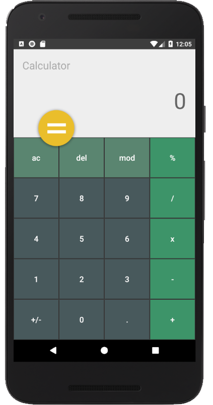

# Android Calculator
### Android development using Java and a personalized UI
#### Technologies
Android and JAVA
## Key operations
"ac" clears the cache
 
"del" deletes the last entered character
 
"mod" does modulus operations. 
#### Screen Shot
 
 
This project is still under development.